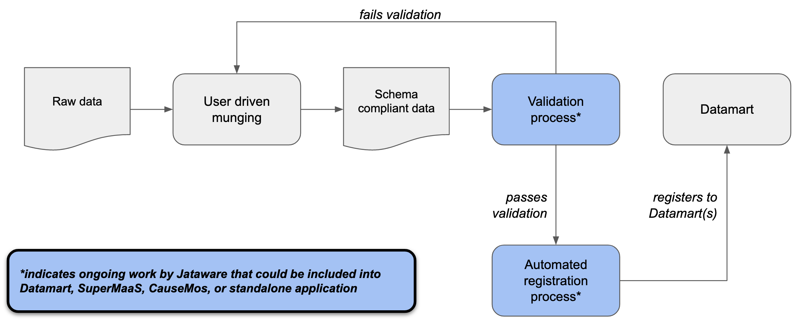

# Datamart Integration

This repository houses code related to integration with D3M Datamarts.

The [verify_and_register](https://github.com/WorldModelers/Datamart-Integration/tree/master/verify_and_register) directory contains code related to validating datasets against a prescribed schema and registering the dataset with a Datamart.

## Process

